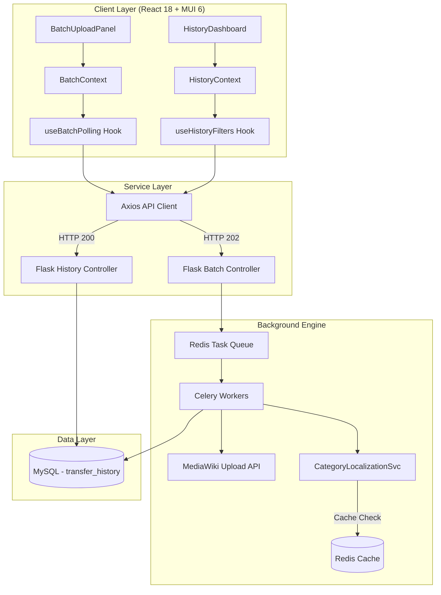

# Wikifile-Transfer Dashboard

A high-performance React 18 dashboard for the **Wikifile-Transfer Enhancement** project (Wikimedia Foundation, GSoC 2026). This tool enables seamless media transfer across Wikipedia projects with advanced batch capabilities and real-time tracking.

## Description
Wikifile-Transfer is a Toolforge web application that helps Wikimedia contributors transfer media files (especially non-free/fair-use images) between different wiki projects. This enhancement project adds batch transfer capabilities, a historical dashboard for tracking uploads, and automated category localization.

## Architecture

### System Flow


### Component Structure
```
┌─────────────────────────────────────────────────────┐
│  Frontend (React 18 + MUI 6)                        │
│  /batch — BatchUploadPanel + BatchProgressTable     │
│  /history — HistoryDashboard + StatsPanel           │
└────────────────────┬────────────────────────────────┘
                     │ HTTP (Axios)
┌────────────────────▼────────────────────────────────┐
│  Controller (Flask Blueprints)                      │
│  POST /api/batch-upload                             │
│  GET  /api/batch-status/{batch_id}                  │
│  GET  /api/history                                  │
│  POST /api/retry/{transfer_id}                      │
└──────────┬──────────────────────┬───────────────────┘
           │ dispatch             │ query
┌──────────▼──────────┐  ┌───────▼───────────────────┐
│  Redis + Celery     │  │  Python Services           │
│  BatchTransferTask  │  │  CategoryLocalizationSvc   │
│  Task queue         │  │  HistoryService            │
│  24h category cache │  │  SQLAlchemy queries        │
└──────────┬──────────┘  └───────────────────────────┘
           │ upload / fetch
┌──────────▼──────────────────────────────────────────┐
│  Data Layer                                         │
│  MySQL — transfer_history table                     │
│  MediaWiki API — Upload, Langlinks, Categories      │
└─────────────────────────────────────────────────────┘
```

## Tech Stack (Exact)

| Layer | Tool | Version |
|---|---|---|
| Framework | React | 18 |
| UI Components | Material-UI (MUI) | 6 |
| Language | JavaScript (ES2022) | — |
| HTTP client | Axios | latest |
| State management | React Context + useReducer | built-in |
| Routing | React Router DOM | v6 |
| i18n | react-i18next | latest |
| Build tool | Vite | latest |
| Testing | Cypress (E2E) | latest |

## How to Run the Application

### 1. Prerequisites
- **Node.js**: Version 20 or higher.
- **Git**: To clone the repository.

### 2. Running with Automation Scripts (Windows)
Navigate to the `wikifile-transfer-frontend` directory and use the provided batch files:
- **`setup.bat`**: Installs all required dependencies.
- **`start.bat`**: Launches the application in **Mock Mode** (no backend required).

### 3. Manual Steps (Cross-platform)
```bash
cd wikifile-transfer-frontend

# Install dependencies
npm install --force

# Start in Mock Mode
VITE_USE_MOCK=true npm run dev

# Start with real Backend
npm run dev
```

The application will be available at `http://localhost:5173`.
