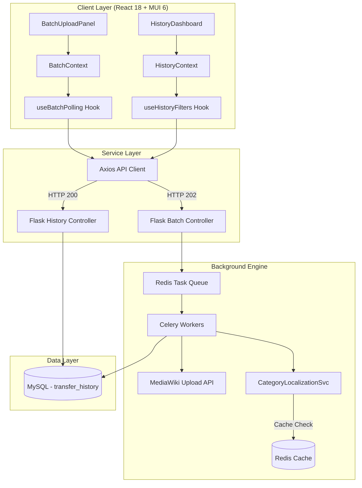

# Google Summer of Code 2026 Proposal - Wikimedia Foundation

## Wikifile-Transfer Batch Upload & History Dashboard

### Enhancement Dashboard — Media Transfer Intelligence

A high-performance, polished interface designed for Wikimedia contributors. This dashboard provides real-time visibility into multi-file transfer operations and enables secure, tracked media migration across the global wiki ecosystem.

---

## Project Description

The **Wikifile-Transfer Dashboard** is a specialized tool under the GSoC 2026 proposal to modernize media transfer workflows within the Wikimedia ecosystem. It replaces traditional, manual single-file transfers with a self-service, real-time platform where contributors can initiate batch operations, monitor their progress, and audit their transfer history across all wiki languages.

The project emphasizes **Operational Efficiency** and **Data Integrity**, ensuring that contributors can move large volumes of media (including non-free content) with automated metadata localization and robust error handling.

### Key Capabilities
- **🚀 Global Batch Transfer**: Initiate up to 50 file transfers in a single operation.
- **🔄 Live Status Polling**: Per-file progress tracking with automatic 2s interval polling.
- **📊 Intelligence Dashboard**: Comprehensive statistics and history filtering for all past operations.
- **🌍 International Support**: Pre-configured with English, Spanish, French, German, and Italian localizations.
- **🛠️ Category Localization**: Automated translation of media categories to the target wiki's language.

---

## Project Motivation

As the Wikimedia movement grows, transferring media across projects remains a bottleneck for many volunteers. This proposal addresses key pain points:

*   **Batch Transfer Efficiency**: Remove the requirement to manually repeat the transfer process for every individual file.
*   **Persistent Transfer Tracking**: Provide a centralized record of all past operations to prevent loss of data during failed attempts.
*   **Metadata Localization**: Automatically translate categories and localize licensing templates during the transfer process.
*   **System Reliability**: Implement a robust polling architecture that ensures users stay informed during long-running background tasks.

---

## System Architecture (High Visibility)

The project follows a modular, state-driven React architecture designed for maximum clarity and performance.



### Data Flow Execution
1. **Initiation**: The contributor selects source file titles and shared metadata.
2. **Dispatch**: The React frontend sends a `POST` request to the Flask API.
3. **Queueing**: Tasks are enqueued in Redis for Celery workers.
4. **Execution**: Workers fetch from origin, localize categories, and upload to the target via the MediaWiki API.
5. **Feedback Loop**: The frontend polls for status updates, reflecting per-file success or failure in real-time.

---

## Technical Stack

| Layer | Tool | Purpose |
|---|---|---|
| **Frontend** | React 18 / MUI 6 | Core UI and Component Architecture |
| **State** | Context API | Modular state for Batch and History |
| **Routing** | React Router v6 | Client-side navigation |
| **i18n** | react-i18next | International support (EN, ES, FR, DE, IT) |
| **API** | Axios | RESTful communication with Flask |
| **Testing** | Cypress | End-to-End verification |

---

## API Reference Overview

### Batch Operations
- `POST /api/batch-upload`: Initiate a new multi-file transfer.
- `GET /api/batch-status/{id}`: Poll the live status of an active batch.

### Analytics & History
- `GET /api/history`: Retrieve paginated and filtered transfer records.
- `POST /api/retry/{id}`: Re-enqueue a failed transfer operation.

---

## How to Run

### 1. Prerequisites
- **Node.js**: Version 20 or higher.
- **Git**: To clone the repository.

### 2. Quick Start (Windows)
For a one-click experience on Windows, use the provided batch files in the **Root** folder:
- **`setup.bat`**: Automatically navigates to the frontend and installs all dependencies.
- **`start.bat`**: Launches the application in **Mock Mode** (no backend required).

### 3. Manual Deployment
Navigate to the `wikifile-transfer-frontend` directory:
```bash
cd wikifile-transfer-frontend
npm install --force
VITE_USE_MOCK=true npm run dev
```

The application will be available at `http://localhost:5173`.

---

## Development Workflow

1. **Local Dev**: Use `VITE_USE_MOCK=true` to work on UI features independently.
2. **Testing**: Run `npm run cypress:run` locally before submitting pull requests.
3. **CI/CD**: Changes pushed to `main` are automatically verified via GitHub Actions.

## Author & Mentors
**Author**: Sunkireddy Barath (GSoC 2026 Contributor)
**Mentors**: @ParasharSarthak, @Jnanaranjan_sahu
**Organization**: Wikimedia Foundation
