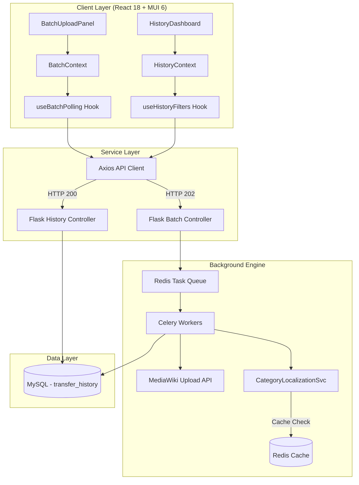

# Wikifile-Transfer Dashboard

A high-performance React 18 dashboard for the **Wikifile-Transfer Enhancement** project (Wikimedia Foundation, GSoC 2026). This tool enables seamless media transfer across Wikipedia projects with advanced batch capabilities and real-time tracking.

## Core Capabilities

- **🚀 Global Batch Transfer**: Initiate up to 50 file transfers in a single operation.
- **🔄 Live Status Polling**: Per-file progress tracking with automatic 2s interval polling.
- **📊 Intelligence Dashboard**: Comprehensive statistics and history filtering for all past operations.
- **🌍 International Support**: Pre-configured with English, Spanish, French, German, and Italian localizations.
- **🛠️ Category Localization**: Automated translation of media categories to the target wiki's language.

## System Architecture



## Technology Stack

### Frontend Foundation
- **React 18**: Component-based UI logic.
- **Material-UI (MUI) 6**: Premium design system with Wikimedia branding.
- **Vite**: Ultra-fast build tool and dev server.
- **React Router 6**: Client-side navigation and deep linking.
- **i18next**: Enterprise-grade internationalization.

### State Management
- **React Context API**: Lightweight, performant state without Redux overhead.
- **useReducer Pattern**: Structured state transitions for complex asynchronous workflows.

## Getting Started

### 1. Prerequisites
- **Node.js**: Version 20 or higher.
- **Backend**: Flask API running on port 5000 (or use Mock Mode).

### 2. Installation
Double-click **`setup.bat`** on Windows or run:
```bash
npm install --force
```

### 3. Execution
Launch in **Mock Mode** (recommended for testing UI without backend):
Double-click **`start.bat`** on Windows or run:
```bash
VITE_USE_MOCK=true npm run dev
```
The application will be available at `http://localhost:5173`.

## Quality Assurance

### Automated Testing
End-to-End tests are implemented using **Cypress** to verify critical user journeys.
```bash
npm run cypress:run    # Execute Headless
npm run cypress:open   # Interactive Testing
```

## Branding & Aesthetics
The tool adheres to Wikimedia's **Open Source Editorial** tone:
- **Colors**: Wikimedia Blue (`#3366CC`), Status Green (`#00AF89`), Error Red (`#D73333`).
- **Typography**: `IBM Plex Sans` for UI, `IBM Plex Mono` for technical identifiers.
- **Iconography**: Official **Indic-TechCom** gear logo used throughout the interface.

## Project Structure
```
src/
├── api/          # Axios service clients & Mock Data
├── components/   # Modular MUI components
│   ├── batch/    # Upload & Progress components
│   ├── history/  # Stats & Table components
│   └── layout/   # Sidebar, Shell & Language switcher
├── context/      # State Providers
├── hooks/        # Polling & Filter logic
├── locales/      # Translation JSONs
└── theme.js      # Global MUI style overrides
```

## Author
**Sunkireddy Barath**
GSoC 2026 | Wikimedia Foundation
[github.com/sunkireddy-Barath](https://github.com/sunkireddy-Barath)
